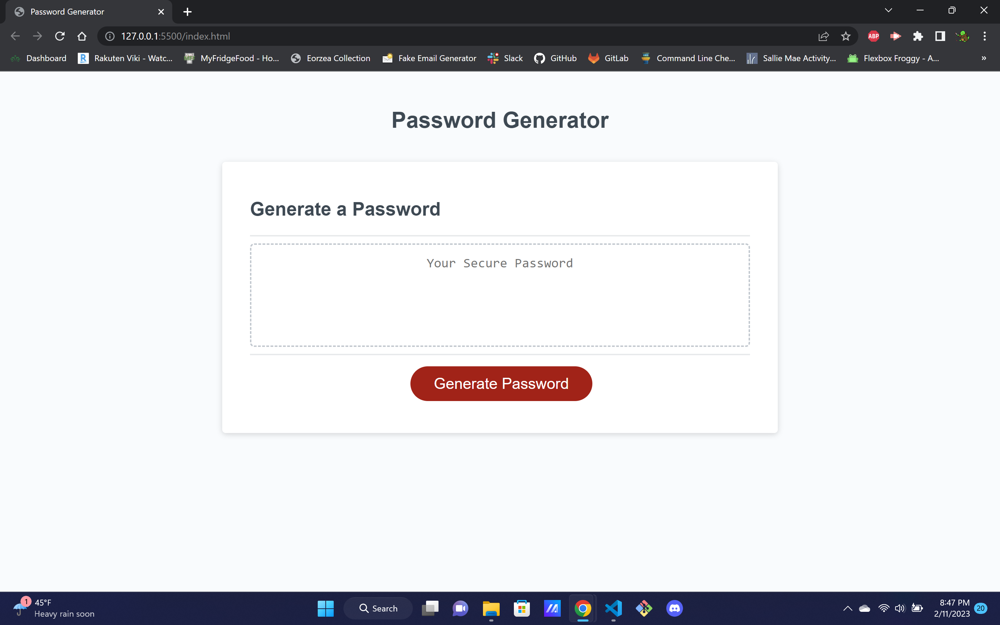

# password-generator

## password generator utilizing javascript

Dont you hate it when websites or comanies make you update your password every 90 days? It can be fine at first but eventually you run out of passwords that you can think of! Using javascript, i created a password generator that gives the user full control on how complex their password will be. This is my FIRST attempt at a project using javascript, but the use of prompt and alert buttons was fun. This was a real test in familiarity with loops and if/else if statements.

website can be found at https://philrug.github.io/password-generator/ 